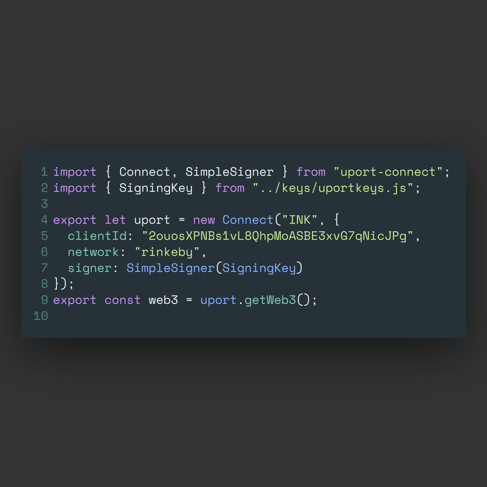
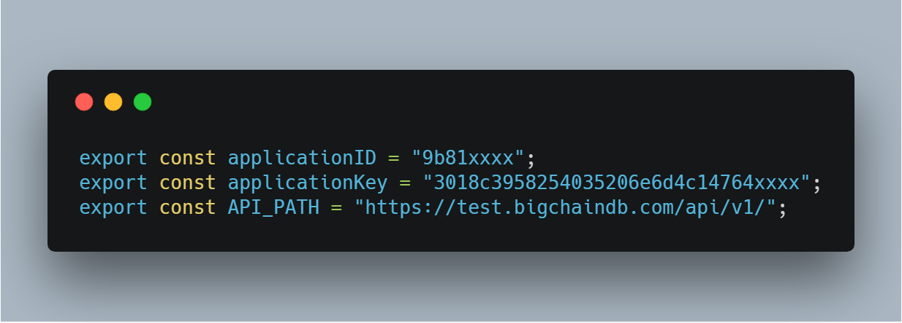

# How to install dependencies and run the project

This process is long and tedious, but, there is no way around it. If you have one, please send a `pull request`.

## Installing NodeJs

The first thing you'll have to do is, install [NodeJs](https://nodejs.org/en/)

## Installing Truffle Framework

We are using a framework called [Truffle](https://truffleframework.com/), since it provides a lot features to develop decentralized applications out-of-the-box.

To install [Truffle](https://truffleframework.com/), run,

`npm install -g truffle`

## Cloning the Git repo

Clone the git repository by running the command,

`git clone https://github.com/ishanjoshi02/Project-INK.git`

## Installing Dependencies

Install the dependencies by running command,

`npm install`

_Note: Do not run `npm audit fix` even if `npm` suggests it. It breaks the `uport-connect` module_

## Getting uPort key

1. To get the `uPort` key, go on over to [uPort App Manager](https://appmanager.uport.me/), and, create your uPort Identity if you don't have one.
2. Next create a project called `INK`.
3. Leave all other fields blank.
4. Save changes to initalize the project.
5. Scan the QR Code again.
6. Click on `Click Here for App Code`.
7. Copy the code inside `SimpleSigner` function. It should resemble something like `5e75f3b9cef1edc5820fdcaa6221ec18c25938155d8622745243d6a80cxxxxxx`
8. Also copy `clientId`.
9. Go to your `INK/src` folder
10. Create a new folder `keys` and file `uportkeys.js`
    It should look something like this:

```
project
|
|-src
  |
  |-keys
    |-uportkeys.js
```

11. Paste the copied key as:

```javascript
export const SigningKey =
  "5e75f3b9cef1edc5820fdcaa6221ec18c25938155d8622745243d6a80cxxxxxx";
```

12. Paste the `SimpleSigner` and `clientId` (Change the key to the one you got the previous step) in `connectors.js`

Your code should look something like this:



_Code Image created with [Carbon](https://carbon.now.sh/)_

13. Get the BigChainDB Keys from [Bigchain](https://testnet.bigchaindb.com/login)

After getting the keys, create a file called `bigchaindbKeys.js`. Your code should look like this



_Code Image created with [Carbon](https://carbon.now.sh/)_

14. Now you can run your project

## Run the project

`npm run start`

## I'm getting some errors. What should I do?

If you're getting some compilation errors, one option is to check what the errors are and install the required dependencies.

For example, if you're getting js-cookie error, install it by `npm i js-cookie`.

Or

Simply run `npm install` which installs all the dependencies which are in [package.json](package.json).
